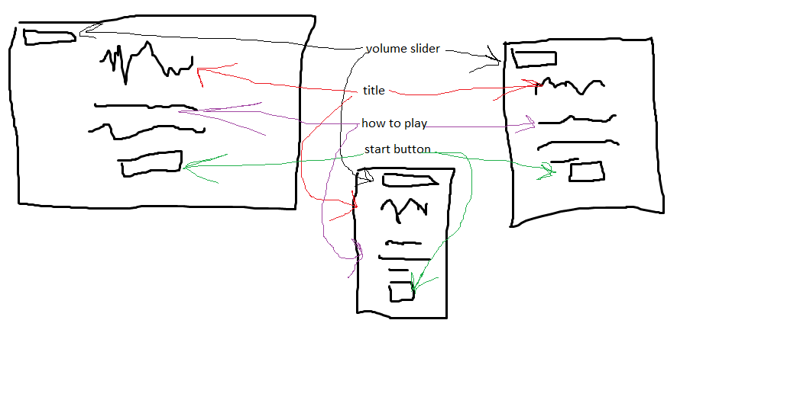
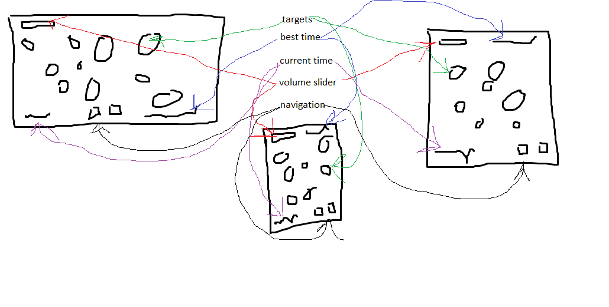
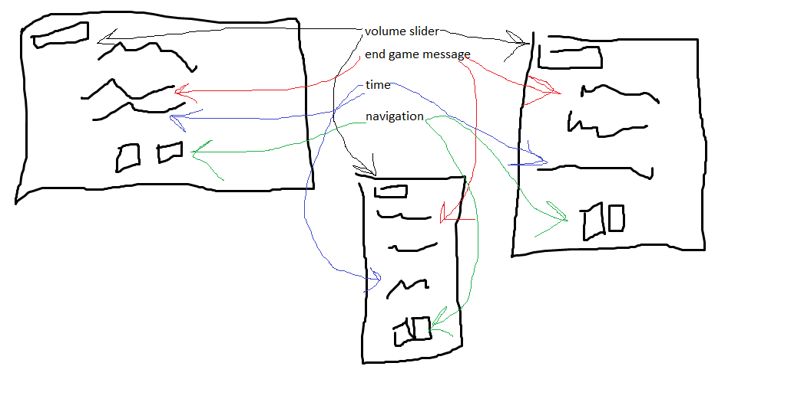
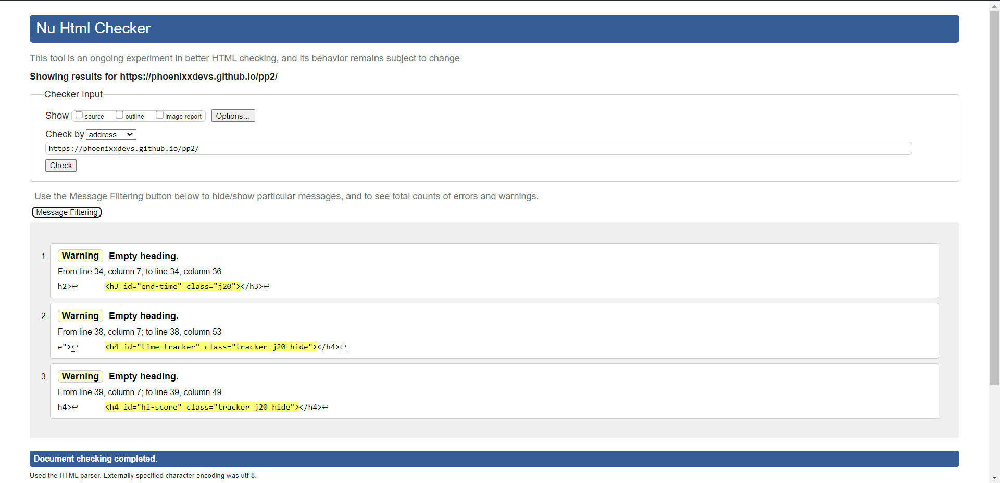
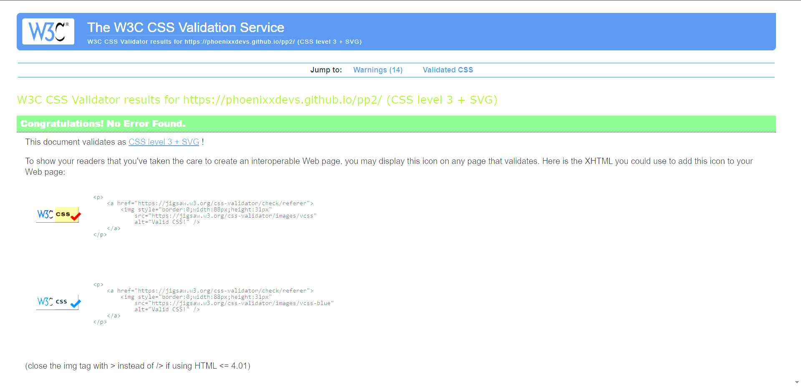
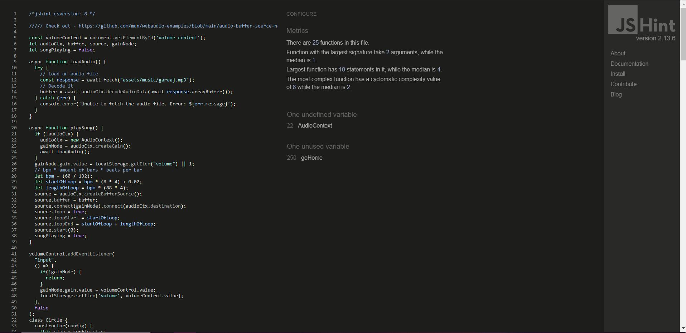

# Aim trainer

[Click Here To Play](https://phoenixxdevs.github.io/pp2/)

---

# Table of Contents

- [Aim trainer](#aim-trainer)
- [Table of Contents](#table-of-contents)
- [Initial Discussion](#initial-discussion)
  - [Mock Ups](#mock-ups)
- [User Experience (UX)](#user-experience-ux)
  - [Important Inclusions](#important-inclusions)
  - [User Stories](#user-stories)
    - [First Time Visitor Goals](#first-time-visitor-goals)
    - [Professional Visitor Goals](#professional-visitor-goals)
    - [Repeat Visitor Goals](#repeat-visitor-goals)
- [Design](#design)
  - [Wireframes](#wireframes)
    - [Home](#home)
    - [Game](#game)
    - [End](#end)
  - [Colour Palette](#colour-palette)
- [Features](#features)
  - [Home Section](#home-section)
  - [Game Section](#game-section)
  - [End Section](#end-section)
  - [Future Additions](#future-additions)
- [Testing](#testing)
  - [Validators](#validators)
    - [HTML](#html)
    - [CSS](#css)
    - [JS](#js)
  - [Testing User Stories](#testing-user-stories)
  - [Accessibility Testing](#accessibility-testing)
  - [Lighthouse Testing](#lighthouse-testing)
    - [Manual Testing](#manual-testing)
    - [Browsers](#browsers)
    - [Bug Fixes](#bug-fixes)
    - [Bug 1](#bug-1)
    - [Bug 2](#bug-2)
    - [Bug 3](#bug-3)
- [Deployment](#deployment)
  - [Cloning and Forking](#cloning-and-forking)
    - [Cloning](#cloning)
    - [Forking](#forking)
    - [Local Deployment](#local-deployment)
    - [Remote Deployment](#remote-deployment)
- [References](#references)
---

# Initial Discussion

Aim Trainer is an online game/tool to practice mouse cursor accuracy. Although the premise is simple, the game should be both fun and addictive.

---

## Mock Ups

---

# User Experience (UX)

## Important Inclusions

- Colour
- Score Tracker
- Music
- Volume Control
- Navigation

---

## User Stories

---

### First Time Visitor Goals
1. As a first time visitor, I want to be able to easily navigate the site to play the game.
2. As a first time visitor, I want to be able to start a new game easily.
3. As a first time visitor, I want audio and colour to keep me interested.
4. As a first time visitor, I want to easily understand what the game is about.

### Professional Visitor Goals
1. As a professional visitor, I want to be able to easily navigate the site to play the game.
2. As a professional visitor, I want to be able to restart quickly as to not waste time.
3. As a professional visitor, I want to be able to use the game as a tool for improving precision and reaction times.
   
### Repeat Visitor Goals
1. As a repeat visitor, I want to be able to enjoy competing against my best times.
2. As a repeat visitor, I want to be able to have my high score saved for when I return.
3. As a repeat visitor, I want to be able to keep my volume setting when I return.

---

# Design

## Wireframes

Below I have provided the basic wireframes for the design of the website. I have also numbered each wireframe with the relevant [User Story](#user-stories) - F = First time visitor, P = Professional visitor, R = Repeat visitor

### Home
F: 1, 2, 3, 4 - P: 1, 2 - R: 3

### Game
F: 2, 3 - P: 2, 3 - R: 1, 2, 3

### End
F: 2, 3, 4 - P: 2, 3 - R: 1, 2, 3

---

## Colour Palette

In the interest of keeping the game fresh, choosing a color palette was not the right solution for me. Instead I decided to go for pastel colours, hard coded for the menus and randomised colours using hsl() for the targets when the game starts.

# Features

## Home Section

- Instructions on how to play the game.
- A start button to begin the aim trainer (interactive on hover and click).
- A volume slider
- Clear instructions on how to proceed

## Game Section

- Display of 15 targets for the user to click.
- Timer to track the user's completion time.
- Feedback on the user's performance and their best time.
- Music with near-perfect loop
- Fading targets
- Custom mouse cursor with trail
- Best time
- Volume slider

## End Section

- Volume Slider.
- Motivational message.
- Time taken to complete.
- Navigation

## Future Additions

- Moving targets.
- Sound on shot.
- Sound on hit.
- Sound on miss.
- Scoring system based on time, combo and target size.

---

# Testing

## Validators

### HTML
[3 warnings about empty headings that I use to insert text](https://validator.w3.org/nu/?showsource=yes&doc=https%3A%2F%2Fphoenixxdevs.github.io%2Fpp2%2F)
 

### CSS
[0 errors](https://jigsaw.w3.org/css-validator/validator?uri=https%3A%2F%2Fphoenixxdevs.github.io%2Fpp2%2F&profile=css3svg&usermedium=all&warning=1&vextwarning=&lang=en)

### JS

## Testing User Stories

## Accessibility Testing

## Lighthouse Testing

### Manual Testing

### Browsers

Everything works as expected in the most recent versions of Chrome, Firefox, Safari, Opera and Internet Explorer.

### Bug Fixes

### Bug 1

Fixed an issue where targets were not registering clicks properly.

### Bug 2

Resolved a timing issue where the timer continued after all targets were clicked.

### Bug 3

Addressed a display issue on smaller screens.

# Deployment

## Cloning and Forking

### Cloning

1. Navigate to the repository.
2. Click on the 'Code' button.
3. Select 'Clone' and copy the URL.
4. Open your terminal and use `git clone [URL]`.

### Forking

1. Navigate to the repository.
2. Click on the 'Fork' button in the top right corner.
3. Follow the on-screen instructions to create a fork of the repository.

### Local Deployment

1. Clone the repository to your local machine.
2. Open the project folder.
3. Open `index.html` in your web browser.

### Remote Deployment

The game is deployed using GitHub Pages. Visit the following link to play: [Phoenixx Aim Trainer](https://phoenixxdevs.github.io/pp2/)

---

# References

https://developer.mozilla.org/en-US/docs/Web/API/Web_Audio_API/Using_Web_Audio_API

https://github.com/mdn/webaudio-examples/blob/main/audio-buffer-source-node/loop/script.js

https://developer.mozilla.org/en-US/docs/Web/API/AudioBuffer#example

https://codepen.io/msaetre/pen/vYMoNX - HOME ICON

https://fossheim.io/writing/posts/css-text-gradient/ - Gradient text